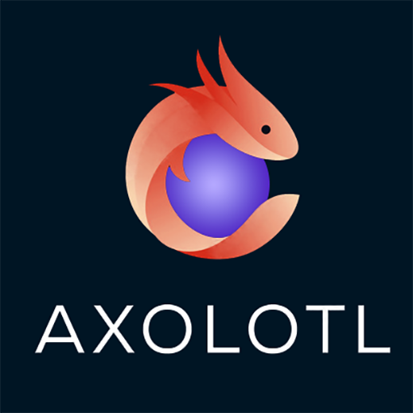
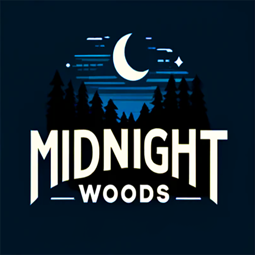

# Task 2 - Developing a Technical Specification

Team Logo                  |  Game Logo
:-------------------------:|:-------------------------:
  |  

## Team Members
* Bodhi Hooper - 1156036
* Lachlan Richards - 1158302

## Introduction

The purpose of this wiki is to discuss the client requiremenets for the 2D platformer project, **Midnight Woods**. This project is being undertaken by the studio **Axolotl** for **Arden Sedmak** and **Olexiy Telyakov**. The handover date for the project is *Friday, 31st May, 2024.

## Table of Contents
* [Proposal](Proposal/index.md)
* [Architecture Options](Architecture/options.md)
* [Architecture Index](Architecture/index.md)

